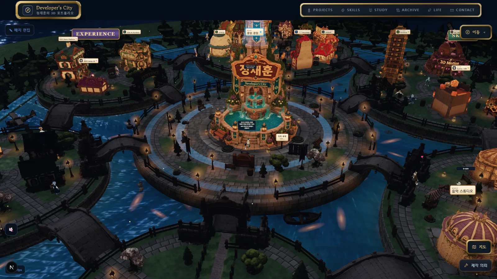
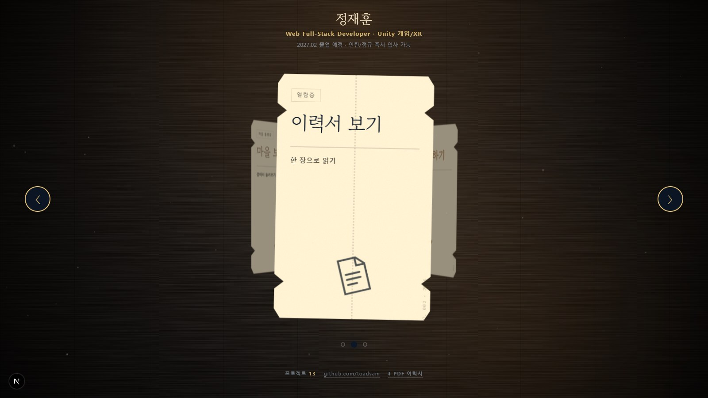
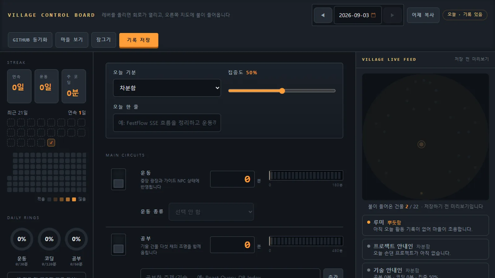
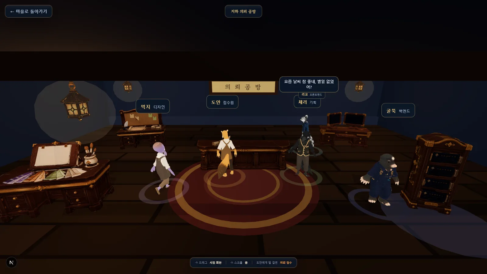
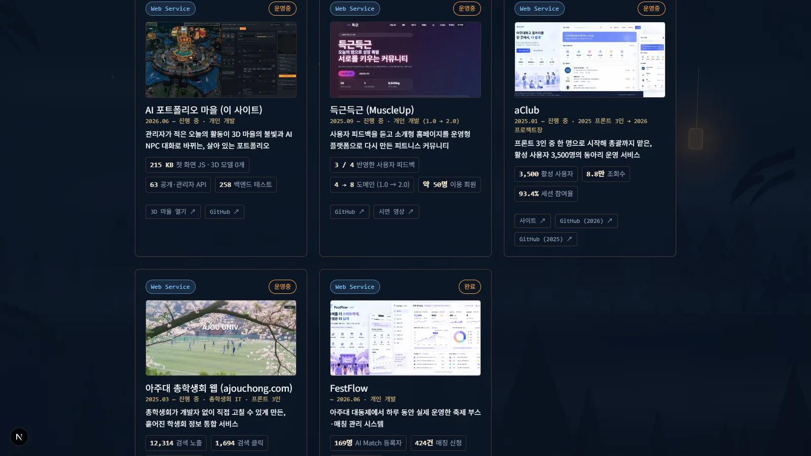
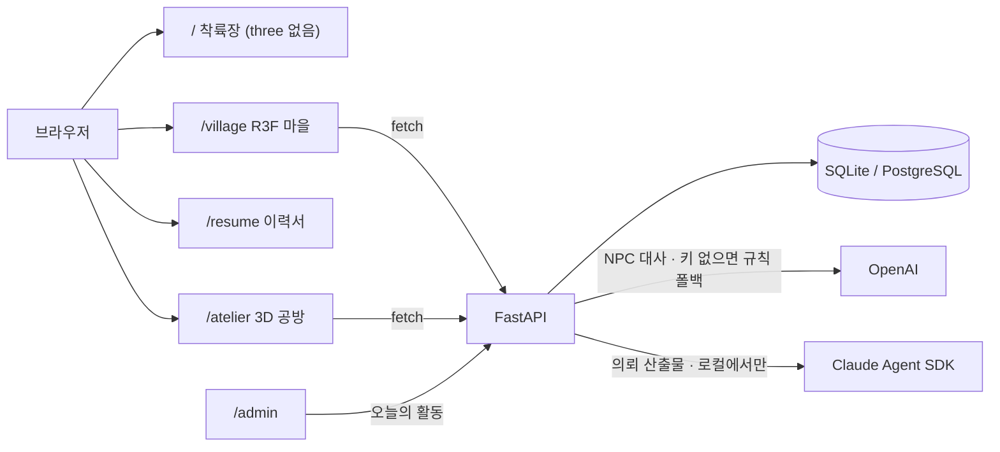

# AI 포트폴리오 마을 (myPortfolio)

관리자가 적은 "오늘의 활동"이 3D 마을의 건물 불빛과 AI NPC 의 기분·대화로 바뀌는 포트폴리오 사이트. 채용 담당자가 한 장으로 읽는 이력서 화면과, 방문자가 웹사이트 제작을 의뢰하는 지하 공방까지 한 서비스에 있다. 혼자 기획하고 만들고 배포했다.

> 코드는 **`final` 브랜치**에 있다. 기본 브랜치 `master` 는 이 저장소가 출발한 developerFolio 템플릿 포크라, 여기 적힌 파일 링크는 `final` 기준이다.



| | |
|---|---|
| 기간 | 2026.06 ~ 진행 중 (Next.js 마을 첫 커밋 2026-06-26 · `final` 브랜치 내 본인 커밋 296) |
| 인원 | 1명 — 기획 · 3D 씬 · 프론트 · FastAPI 백엔드 · 관리자 · 배포. 개발은 Claude Code 와 짝으로 했고 계획 승인·실측·검증은 사람이 했다 — [`CLAUDE.md`](CLAUDE.md) 가 그 작업 규약이다 |
| 배포 | https://my-portfolio-5ow2.vercel.app (프론트 Vercel · 백엔드 Railway + PostgreSQL) |

## 5분만 있다면

1. [`src/app/page.tsx#L3-L16`](src/app/page.tsx#L3-L16) — 첫 화면이 three.js 를 한 바이트도 안 싣게 된 이유. 그 아래 [`#L51-L59`](src/app/page.tsx#L51-L59) 의 두 줄이 마을을 미리 받는 전부다. 아래 「결정과 근거」 첫 항목.
2. [`backend/app/services/relationship_rules.py#L268-L326`](backend/app/services/relationship_rules.py#L268-L326) — NPC 둘이 마주쳤을 때 관계가 어떻게 되는지 정하는 순수 함수. 모델은 이 결과에 맞는 대사만 쓴다.
3. [`src/components/village/LightPool.tsx#L3-L33`](src/components/village/LightPool.tsx#L3-L33) — 실광원 "개수"를 고정해 셰이더 재컴파일을 없앤 자리. 왜 줄이지 않고 고정하는지, 실측 수치가 주석에 있다.

## 무엇이 돌아가나

| | |
|---|---|
|  |  |
| 첫 화면은 마을이 아니라 **표 세 장**이다. 가운데가 이력서. three.js 는 마을 표에 마우스를 올릴 때 받기 시작한다. | 관리자 페이지. 기분·집중도·운동·공부·커밋을 적으면 저장 전 미리보기 지도에 건물 불이 켜지고, 안내 NPC 들의 기분이 바뀐다. |
|  |  |
| 의뢰 공방. 접수원과 네 직군 NPC 가 릴레이로 묻고 견적을 굴린다. 이 사이트에서 **바깥사람이 쓰기를 하는 유일한 경로**라 허니팟·전용 레이트리밋·견적 상하한이 붙어 있다. | 이력서. 카드 지표에는 출처 필드(`metricsSource`)가 붙고, 같은 데이터(`src/data/resume.ts`)에서 A4 2장 PDF 를 찍는다(`npm run resume:pdf`). |

이 밖에 건물 27채(광장 포함) 마다 안내 NPC 가 하나씩 자동으로 붙고, NPC 끼리 마주쳐 친해지거나 다투며 그 소식이 HUD 피드에 오른다. 프로젝트 건물에 들어가면 프로젝트별 전시실이 열리고, 코딩 테스트·CS 기록을 넣는 학습 구역이 따로 있다. 상세는 [`docs/PROJECT_DOCUMENTATION.md`](docs/PROJECT_DOCUMENTATION.md), NPC 사회는 [`docs/NPC_SOCIETY.md`](docs/NPC_SOCIETY.md), 공방은 [`docs/COMMISSION_ATELIER.md`](docs/COMMISSION_ATELIER.md).

## 구조



| 프론트 | 백엔드 |
|---|---|
| Next.js 16 · React 19 · TypeScript · React Three Fiber 9 · three 0.183 · drei · postprocessing · framer-motion | FastAPI 0.115 · SQLAlchemy 2 · pydantic-settings · httpx · Claude Agent SDK(선택) |
| 방문자 라우트 `/` `/village` `/resume` `/atelier` `/commission/[token]` + `/admin` (그 외 `*-preview` 는 전시실 미리보기) | 라우트 65 (2026-09-07 `main.py` 데코레이터 수) · pytest 258 |

## 결정과 근거

**첫 화면은 라우트로 가른다 — 장치로 막지 않는다.** 예전에는 `/` 가 마을 그 자체였고 인트로는 그 위의 오버레이였다. 이력서만 볼 사람도 인트로를 읽는 동안 뒤에서 GLB 87개(20.7 MB)를 받았다. "들어갈 기색이 보이면 그때 씬을 올린다"(hover 무장·정적 배경·빈 div)를 여럿 달아 봤는데, 씬을 떼자 섹션이 65px 로 접혀 첫 화면이 깨졌다 — 섹션 높이를 씬이 만들고 있었다. 그래서 `/`, `/village`, `/resume`, `/atelier` 로 나눴다. Next 가 주소 단위로 코드를 쪼개니 첫 화면은 마을 청크를 요청조차 하지 않는다. 대가는 미리 받기를 손으로 챙겨야 한다는 것 — `router.prefetch` 는 라우트 껍질만 받고 씬은 `dynamic` 안에 숨어 있어서, 씬 모듈 `import()` 를 한 줄 더 부른다([`page.tsx#L51-L59`](src/app/page.tsx#L51-L59)). 한 번 더 걸린 함정: 착륙장에 이름 한 줄을 띄우려고 `@/data/resume` 를 import 했더니 이력서 전체가 첫 화면 번들에 들어와 216→221 KB 가 됐다. 그래서 첫 화면이 실제로 읽는 셋만 [`hero.ts`](src/data/hero.ts#L1-L15) 로 내렸다.

**실광원은 개수를 줄이는 게 아니라 고정한다.** three 는 씬의 광원 개수가 바뀌면 그 씬의 모든 재질 셰이더를 다시 컴파일한다. 마을은 NPC 행동·건물 강조·활동 발광이 전부 `{조건 && <pointLight/>}` 라 개수가 8↔11 로 흔들렸고, 하나 바뀔 때마다 셰이더 프로그램이 19개 늘며 3~7초 멈췄다. 처음 짐작은 "광원을 줄이면 된다"였다. 상주 광원을 8·10·12 로 늘려 가며 정지 FPS 를 재 보니 추세가 없었다(49.3 / 43.2 / 50.3, 같은 8개 재측정 38.1) — 많은 것은 거의 공짜고 바뀌는 것만 재앙이었다. 그래서 풀을 6개 미리 켜 두고 요청이 오면 옮겨 쓴다(`intensity=0` 으로 끈다, `visible=false` 는 개수에서 빠져 다시 재컴파일된다). 6 은 동시 수요 실측치(건물 강조 1 + NPC 행동 2 + 활동 발광 3). 대가는 풀이 모자라면 카메라에서 먼 것부터 꺼진다는 것. [`LightPool.tsx#L3-L33`](src/components/village/LightPool.tsx#L3-L33). 가로등 수십 개는 실광원이 아니라 가산 스프라이트 빛무리다([`VillageScene.tsx#L667-L681`](src/components/village/VillageScene.tsx#L667-L681)).

**NPC 관계는 규칙이 정하고, 모델은 대사만 쓴다.** 처음엔 두 NPC 가 마주치면 모델에게 "대사를 쓰고 둘 사이가 얼마나 바뀌었는지도 네가 정해라"고 시켰다. 모델은 소설가라 거의 언제나 훈훈하게 끝냈고, 친밀도는 오르기만 해서 전원 절친으로 수렴했다. 싸운 직후 기분을 `excited` 로 보낸 적도 있다([`docs/NPC_SOCIETY.md`](docs/NPC_SOCIETY.md)). 지금 `POST /npc/encounter`([`main.py#L522`](backend/app/main.py#L522)) 는 먼저 순수 함수 `decide_outcome` 이 결과를 정한다 — 기분 궁합, 오늘 활동의 공통 화제, 12% 확률의 사건, 공통 친구·적에 따른 편 들기를 더해 ±5 로 자른다([`relationship_rules.py#L268-L326`](backend/app/services/relationship_rules.py#L268-L326)). 모델은 그 사건이 드러나는 4줄만 쓰고, 실패하면 사건 종류별 폴백 대사가 나간다. 모델이 돌려주는 `relationship`/`state_changes` 는 읽지 않는다. 대가는 규칙이 못 만드는 사건은 생기지 않는다는 것, 얻은 것은 `tests/test_relationship_rules.py` 로 잠글 수 있다는 것. 같은 원칙이 공방 견적에도 있다 — 모델이 낸 금액은 규칙 기준선의 0.6~1.8배 안으로만 허용한다([`commission_service.py#L161-L177`](backend/app/services/commission_service.py#L161-L177)). 공방 3단계에서 네 직군 에이전트가 파일을 쓰더라도 진행 권한은 관리자의 [`gate.apply_gate()`](backend/app/agents/gate.py#L166-L200) 하나뿐이고, 도구 호출은 `can_use_tool` 콜백이 경로 단위로 막는다([`runner.py#L10-L22`](backend/app/agents/runner.py#L10-L22) — `acceptEdits` 나 `allowed_tools` 에 이름을 넣는 순간 콜백이 조용히 건너뛰어진다는 함정 포함).

## 잰 것

| 항목 | 값 | 조건 |
|---|---:|---|
| 첫 화면 JS | 215.6 KB · GLB 0개 | 프로덕션 빌드 `/` 청크 합 · 2026-09. 마을 표에 마우스를 올리면 920 KB 로 는다 |
| 라우트 분리 전 첫 화면 | GLB 87개 · 20.7 MB | 인트로 오버레이 뒤에서 마을이 통째로 뜨던 구조 |
| 광원 개수 변동 시 | 셰이더 프로그램 +19개 · 3~7초 멈춤 · 입장 후 40초 5.5→16.9 fps | 개발 PC. NPC 행동을 막아 개수를 고정한 같은 장면은 10초 만에 44~50 fps, 최악 프레임 110~150 ms |
| 백엔드 | 라우트 65 · pytest 258 | 2026-09-07 `backend/app/main.py` 데코레이터 수 · `backend/tests/` 의 `def test_` 수 |

## 알고 있는 빚

- 프론트 테스트가 없다. 백엔드 pytest 258개는 순수 로직(마을 상태 파생·관계 규칙·게이트·견적 클램프)과 일부 라우트 스모크만 덮고, OpenAI 를 부르는 경로는 안 덮는다.
- 저장소가 무겁다. `public/models/props/raw/` 의 Meshy 원본 GLB 14개(217 MB)와 옛 CRA 포트폴리오 이미지 131장(158 MB)이 그대로 추적되고 있다. `.gitignore` 주석은 raw 를 넣지 말라고 적어 두고 정작 넣었다.
- 기본 브랜치가 `master`(템플릿 포크)다. Vercel·Railway 도 처음엔 master 를 잡아 매번 손으로 `final` 로 바꿨다. 기본 브랜치 변경이 남아 있다.
- `src/App.js`, `src/index.js`, `src/containers/`, `src/components/` 의 소문자 폴더들(`header`·`footer`·`portfolio` 등), 루트의 `fetch.js` 는 옛 CRA 포트폴리오다. 빌드 대상이 아니고(`tsconfig` 는 `src/**/*.ts(x)` 만 본다) 참고용으로 남겨 뒀다. `.github/workflows/pages.yml` 도 그 시절 것이다.
- `.ua/`(코드 분석 도구 산출물 102개)와 `.tmp_*.js` 두 개가 추적되고 있다. 지워야 한다.
- 의뢰 공방 3단계(에이전트가 실제 파일을 쓰는 단계)는 배포 서버에서 돌지 않는다. `AGENT_WORKER_ENABLED` 가 기본 false 라 `npm run atelier` 로 로컬에서 돌린다.
- 첫 화면 무게는 손으로 잰 값이다. 번들 크기를 CI 에서 재는 장치가 없어 누가 `@/data/resume` 를 다시 import 해도 아무도 모른다.

## 실행하기

<details>
<summary>프론트 3000 · 백엔드 8000 · 관리자는 /admin</summary>

필요한 것: Node 22(`resume:pdf` 가 `--experimental-strip-types` 를 쓴다), Python 3.12(`backend/.python-version`). OpenAI 키가 없어도 NPC 는 규칙 기반 대사로 답하고, GitHub 토큰이 없으면 동기화만 건너뛴다.

**백엔드.**

```bash
cd backend
python -m venv .venv && .venv\Scripts\activate
pip install -r requirements-dev.txt      # requirements.txt + pytest
copy .env.example .env
cd .. && npm run backend:dev             # uvicorn 을 띄우고 backend/app/**/*.py 를 감시해 재시작
pytest                                   # backend/ 에서, in-memory SQLite, .env 불필요
```

`backend/.env` 가 읽는 이름(`backend/app/config.py`): `DATABASE_URL`(기본 로컬 SQLite), `FRONTEND_ORIGIN`, `OPENAI_API_KEY`, `OPENAI_MODEL`, `OPENAI_NPC_MODEL`, `GITHUB_TOKEN`, `GITHUB_USERNAME`, `LOCAL_TIMEZONE`, `ADMIN_PASSWORD`(비면 /admin 인증이 꺼진다 — 배포 시 필수), `ADMIN_SECRET`, `ADMIN_TOKEN_TTL_HOURS`, `AI_RATE_PER_MIN`, `AI_DAILY_LIMIT`, `DISCORD_WEBHOOK_URL`, `COMMISSION_RATE_PER_HOUR`, `COMMISSION_ATTEMPTS_PER_HOUR`, `COMMISSION_DAILY_LIMIT`. 공방 에이전트를 돌릴 때만 `requirements-agent.txt` 와 `AGENT_WORKER_ENABLED`, `AGENT_MAX_TURNS`, `AGENT_TIMEOUT_SECONDS`, `AGENT_MODEL`, `ANTHROPIC_API_KEY`.

**프론트.** 루트 `.env.local` 의 `NEXT_PUBLIC_API_BASE_URL` 하나(비면 `http://localhost:8000`).

```bash
npm install
npm run dev          # http://localhost:3000
npm run build && npm run start
npm run typecheck    # tsc --noEmit — lint 스크립트와 JS 테스트 러너는 없다
npm run resume:pdf   # src/data/resume.ts 에서 A4 2장 PDF
npm run optimize     # public/models 의 GLB 압축 (scripts/optimize-glb.mjs)
```

렉을 볼 때는 프로덕션 빌드로 잰다 — dev 는 StrictMode 이중 렌더로 롱태스크가 남는다.

</details>

<details>
<summary>폴더</summary>

```text
src/app/            라우트 — page(착륙장) · village · resume · atelier · admin · api/props(dev 전용 배치 편집)
src/components/     village(R3F 씬·NPC·건물·HUD) · ui(패널·전시실·공방) · interior · admin — 소문자 폴더는 옛 CRA
src/data · src/lib  이력서·프로젝트·NPC 명단·대본 데이터 · constants(건물 배치) · liveApi(백엔드 호출)
backend/            app/main.py(라우트 65) · app/services/(활동→마을 상태·NPC 대화·관계·공방) · app/agents/(공방 3단계) · tests/
public/models/      최적화된 GLB(건물·소품·캐릭터) — raw/ 는 원본
docs/               PROJECT_DOCUMENTATION · NPC_SOCIETY · COMMISSION_ATELIER · ATELIER_GUIDE · screenshots
```

</details>

## 만든 사람

정재훈 — 아주대학교. 다른 작업은 [GitHub](https://github.com/toadsam) 에 있고, 이 사이트의 [이력서 화면](https://my-portfolio-5ow2.vercel.app/resume) 에서 한 장으로 볼 수 있다.

코드와 화면은 포트폴리오 공개 목적이며, 별도 표기 전까지 무단 사용·복제·배포를 허용하지 않는다.
